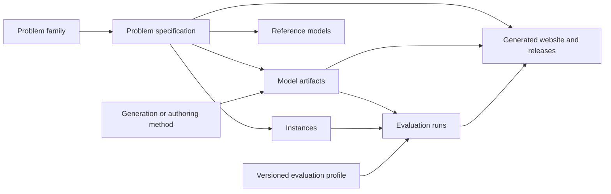

# DCP-Bench Open: Registry Architecture and Implementation Roadmap

Status: design proposal

Scope: repository/backend first; website integration follows

Snapshot reviewed: 2026-08-11

## 1. Executive decision

DCP-Bench Open should evolve from a benchmark repository with a generated website into a **versioned, evidence-bearing registry of discrete combinatorial problems, instances, model artifacts, generation methods, and evaluation results**.

The repository should remain the canonical, reviewable source of truth. The website should remain a read-only projection built from repository data. A dynamic database or public model-execution service is not needed yet.

The practical architecture has four layers:

1. **Problem registry**: problem specifications, instances, reference models, source attribution, and stable identities.
2. **Model registry**: human-authored, translated, imported, or machine-generated model artifacts in multiple frameworks, with explicit provenance.
3. **Evaluation framework**: versioned evaluation profiles, framework adapters, isolated execution, and immutable machine-readable evidence.
4. **Publication layer**: the website and downloadable releases, generated only from validated registry records.

The central scientific principle is:

> Publish evidence about what was tested, not an unqualified claim that a model is correct.

A generated program that returns one valid solution for the first instance has passed a useful test. It has **not** thereby been shown to be a correct parameterized model of the problem class.

## 2. Product position

The valuable goal is not merely “a larger CSPLib.” Existing resources already cover important parts of the space:

- [CSPLib](https://www.csplib.org/) curates structured constraint problems and community contributions.
- [XCSP3](https://www.xcsp.org/) provides a standard representation, tooling, and a large instance collection.
- The [MiniZinc Challenge](https://www.minizinc.org/challenge/) maintains models, instances, solver evaluation practices, and a competition ecosystem.
- [Hakan Kjellerstrand's collections](https://www.hakank.org/common_cp_models/) provide broad, valuable cross-framework model examples.
- [OR-Library](https://people.brunel.ac.uk/~mastjjb/jeb/info.html) is an established source of operations-research test instances.

DCP-Bench Open can be distinctive by joining five things that are usually fragmented:

1. a human-readable problem specification;
2. structured instances and output semantics;
3. comparable implementations in multiple modeling frameworks;
4. traceable human or machine generation provenance; and
5. explicit, reproducible evaluation evidence.

“Single point of access” should initially mean a **curated and federated catalogue**, not a promise to copy every artifact from every upstream source. Where redistribution rights, synchronization cost, or canonical ownership are unclear, the registry should index and link to the upstream artifact instead of mirroring it.

The project should avoid claiming completeness until community adoption and coverage support that claim. “Open registry” or “curated catalogue” is defensible earlier than “the universal repository.”

## 3. What exists today

The current repository already contains early versions of all four layers:

| Concern | Current implementation | Main limitation |
|---|---|---|
| Problems and instances | `dataset/`, compiled into `dcp-bench-open.jsonl` by `jsonl_convert.py` | Important semantics are inferred from executable Python and description text rather than governed by schemas. |
| Model artifacts | `generated_models/<problem>/<framework>/<submission>/` | Artifacts are called “generated” even when origins vary, and the manifest does not describe the method, prompt, dependency versions, license, or artifact scope. |
| Evaluation | `eval.py`, imported `summary.txt` files, and `metrics_passed.json` | Evaluation is text-oriented, executes submitted code directly, and currently checks only instance 0. |
| Website | `generate_site.py`, `web/`, and generated `site/` | The website reads repository files directly, but selects only one passing artifact per framework and collapses nuanced evidence into a badge. |

Current inventory:

- 164 problem directories;
- 1,692 stored model artifacts across CPMpy, MiniZinc, and OR-Tools;
- generated-model coverage for 148 problems;
- every imported evaluation record declares `instances_checked: [0]`;
- provenance currently contains only the base LLM and dataset version, plus links to legacy submission/results artifacts;
- 671 imported artifacts have an `unknown` badge, while the others report outcomes derived from the legacy single-instance protocol.

This is a strong prototype, not a clean long-term contract. The right next step is to introduce schemas and boundaries before adding substantially more content.

## 4. Domain model

Problem identity must not be based only on a display name. “Knapsack,” for example, can denote multiple precise formulations. Use three levels:

- **Problem family**: a discoverable conceptual family, such as knapsack or job-shop scheduling.
- **Problem specification**: an exact statement of variables, constraints, objective semantics, and input/output contract.
- **Instance**: a concrete, immutable data payload for one specification.

The rest of the registry attaches to those precise identities:



### 4.1 Model artifact scope

Every model artifact must explicitly declare one of these scopes:

- `problem_class`: parameterized implementation intended to accept any conforming instance;
- `instance_set`: implementation intended for a declared subset of instances;
- `fixed_instance`: generated program for exactly one immutable instance.

Legacy leaderboard artifacts should initially be imported as `fixed_instance` for instance 0 unless stronger evidence exists. This prevents a one-instance submission from being presented as a reusable formulation for the whole problem class.

### 4.2 Model origin

Use **model artifact** as the neutral entity name. Its `origin_type` should distinguish:

- `reference`;
- `human_authored`;
- `human_translated`;
- `machine_generated`;
- `hybrid`;
- `imported_unknown`.

“Generated model” can remain a website filter, but should not be the storage ontology for everything.

## 5. Target repository structure

Do not move `dataset/` in the first implementation. Introduce the new contracts alongside it and migrate incrementally.

```text
dataset/                         # Existing problem source; unchanged in phase 1
generated_models/                # Legacy imported artifacts; read through an adapter

models/                          # New canonical model artifacts
  <problem_id>/
    <framework>/
      <artifact_id>/
        model.<ext>
        manifest.json
        README.md                # Optional artifact-specific notes

methods/                         # Reusable authoring/generation method records
  <method_id>/
    manifest.json
    README.md
    prompts/                     # Optional; exact prompt files or templates
    workflow/                    # Optional; executable method implementation
    environment/                 # Optional lockfile/container references

evaluation/                      # Evaluation implementation
  profiles/                      # Versioned evaluation policies
  adapters/                      # CPMpy, MiniZinc, OR-Tools, future frameworks
  checks/                        # Schema, execution, feasibility, objective, etc.
  runners/                       # Isolated execution orchestration

evaluations/                     # Immutable evaluation evidence
  <artifact_id>/
    <evaluation_run_id>/
      result.json
      logs/                      # Only bounded, sanitized diagnostic output

schemas/                         # JSON Schemas for all governed records
  problem.schema.json
  model-artifact.schema.json
  method.schema.json
  evaluation-profile.schema.json
  evaluation-result.schema.json

dcpbench/                        # Python package and CLI
  registry.py
  validation.py
  cli.py

web/                             # Website source
site/                            # Generated output; never canonical data
```

Long term, problem metadata can move into an explicit `problem.json` sidecar within each existing `dataset/<problem_id>/` directory. During migration, a compiler can derive draft problem records from the current `.cpmpy.py` and `.json` files. The derived JSONL must not become a competing manually edited source of truth.

## 6. Required contracts

### 6.1 Problem record

A problem record should eventually contain:

- stable `problem_id`, optional `family_id`, title, aliases, and variant labels;
- satisfaction or optimization type;
- precise objective direction and objective-value representation;
- input schema and output schema;
- decision-variable projection used for evaluation;
- instance identifiers and content hashes;
- reference-model identifiers;
- source URL, bibliographic citation, authorship, license/SPDX expression, and redistribution status;
- deprecation/replacement links when semantics change.

Do not silently repair the semantics of a published problem under the same release identity. Corrections should produce a new dataset release, and material semantic changes may require a new problem-specification version.

### 6.2 Model artifact manifest

Minimum fields:

```json
{
  "schema_version": "1.0",
  "artifact_id": "n_queens--cpmpy--example_method--v1",
  "problem_id": "csplib_054_n_queens",
  "scope": "problem_class",
  "instance_ids": [],
  "framework": "CPMpy",
  "framework_version": "4.x",
  "entrypoint": "model.py",
  "io_contract": "dcpbench-json-stdin-v1",
  "origin_type": "machine_generated",
  "method_id": "example_method--v1",
  "problem_release": "v0.3.0",
  "problem_digest": "sha256:...",
  "artifact_digest": "sha256:...",
  "license": "Apache-2.0",
  "authors": [],
  "submitted_by": "..."
}
```

The manifest must identify the exact problem content used during generation. A dataset version label alone is insufficient if the referenced content can change.

### 6.3 Method manifest

The method is distinct from the model artifact it produced. A method record should describe:

- method name, version, authors, license, citation, and repository/commit;
- method class, for example direct prompting, self-debugging, sampling and selection, multi-agent, or human translation;
- base model/provider and exact version where disclosure is permitted;
- prompt/template files and hashes;
- generation parameters, tool access, stopping rule, candidate-selection rule, and random seeds;
- environment or container digest;
- whether the record is descriptive only or executable;
- known manual interventions.

Use graded provenance levels:

- **P0 - unknown**: only an artifact and source link are known;
- **P1 - declared**: method, model, and high-level configuration are declared;
- **P2 - inspectable**: prompts, workflow code, versions, and selection logic are available;
- **P3 - reproducible**: an environment and documented command can regenerate the artifact, subject to external API nondeterminism.

The first public method registry should accept P1/P2 packages. Requiring every contributor to ship a fully executable agent pipeline immediately would create too much friction and security burden.

### 6.4 Standard model execution contract

Parameterized artifacts need a framework-independent boundary:

1. receive one instance as JSON through a declared file or stdin contract;
2. write exactly one structured result object to stdout or a declared output file;
3. separate diagnostics to stderr;
4. report solver status (`sat`, `unsat`, `optimal`, `feasible`, `unknown`, `error`);
5. include the official output projection and, where applicable, objective value and proof status;
6. run under explicit time, memory, CPU, dependency, and solver limits.

Framework adapters may implement this boundary differently internally, but evaluation should consume the same normalized result schema.

## 7. Evaluation architecture

### 7.1 Separate evidence axes

Never reduce evaluation to a single internal Boolean. Record at least:

1. **manifest/schema conformance**;
2. **build/import success**;
3. **execution status**;
4. **output-schema conformance**;
5. **solution feasibility** under the reference specification;
6. **objective-value agreement**, when applicable;
7. **optimality status**: proven, matched known optimum, not proven, not applicable, or unknown;
8. **instance coverage**;
9. **resource measurements**;
10. **evaluator/profile/environment versions**.

Each check should use an explicit status vocabulary:

```text
passed | failed | error | timeout | not_evaluated | not_applicable
```

An error or timeout is not a failed semantic assertion, and neither is evidence of correctness.

### 7.2 Versioned evaluation profiles

Evaluation meaning belongs in versioned profiles, for example:

- `legacy-instance0-v1`: faithfully represents the current imported evidence;
- `public-smoke-v1`: schema, execution, and feasibility on one toy instance;
- `public-multi-instance-v1`: evaluation on all declared public instances;
- `heldout-generalization-v1`: operator-run evaluation on unseen instances;
- `semantic-sampling-v1`: optional multi-solution or property-based comparison.

Results must include the profile ID and version. Changing a check or timeout creates a new profile version rather than silently changing old evidence.

### 7.3 Scientifically honest website labels

Good labels are bounded claims such as:

- `Executes`;
- `Feasible solution: 1/1 tested instance`;
- `Objective matched: 8/8 tested instances`;
- `Optimality proven by solver: 8/8`;
- `Parameterized model: public instances 10/10`;
- `Legacy evidence`;
- `Human reviewed`.

Avoid an unqualified green “Correct model” badge. Finite testing cannot prove semantic equivalence for a general parameterized model, and the current single-instance protocol can be passed by a hard-coded solution.

### 7.4 Multi-solution evaluation

Multi-solution comparison is a useful later profile, not the immediate foundation. It requires:

- a canonical output projection;
- a fixed enumeration order or set-based comparison;
- blocking constraints or equivalent enumeration support;
- explicit treatment of symmetries;
- for optimization, objective ordering and deterministic tie-breaking.

It should supplement, not replace, feasibility and objective checks. Its cost and semantics vary substantially by framework and problem.

### 7.5 Security boundary

`eval.py` currently executes submitted Python directly. That is acceptable only for trusted local experiments. It must not become a public automated service in its current form.

Before evaluating arbitrary community artifacts, execution needs:

- disposable containers or equivalent isolation;
- no repository, host, network, or secret access by default;
- read-only inputs and a bounded writable scratch directory;
- CPU, memory, process, output-size, and wall-clock limits;
- pinned dependencies and solver versions;
- explicit operator control over expensive or proprietary solvers.

Pull-request CI should validate manifests and static structure first. Running untrusted artifact code should be a separate, hardened workflow.

## 8. Contribution and publication workflow

Use a state machine rather than presence/absence of `metrics_passed.json`:

```text
submitted -> schema_valid -> evaluation_pending -> evaluated -> published
                                            \-> rejected
published -> disputed -> superseded/deprecated
```

A contribution should follow this flow:

1. Contributor adds a model artifact and manifest in a pull request.
2. CI validates identity, schema, paths, hashes, license fields, and framework adapter availability.
3. Maintainer review checks problem mapping, provenance, and redistribution rights.
4. A hardened evaluator produces a new immutable `result.json`.
5. Publication policy decides whether and how the artifact appears on the site.
6. The site is regenerated from validated records.

Published artifacts and evaluation records should be immutable. Corrections create a new artifact or evaluation run linked through `supersedes`; they do not rewrite history.

## 9. Website projection

Once the backend contracts exist, each problem page should expose:

- **Overview**: precise problem specification, family/variant, sources, license, and release;
- **Instances**: identifiers, provenance, size/features, visibility, and known objective bounds;
- **Reference models**: one or more curated formulations;
- **Model artifacts**: all artifacts, filterable by framework, scope, origin, method, provenance level, and evidence profile;
- **Evaluation**: per-axis and per-instance evidence, evaluator version, and logs where safe;
- **Method**: link to the method record, prompts/workflow, paper, and reproducibility level;
- **Report**: a prefilled GitHub issue containing problem ID, artifact ID, evaluation-run ID, and site commit.

The site should not silently discard all but one artifact per framework. It may recommend or rank artifacts under an explicit policy, but users must be able to inspect every published artifact and understand why one is highlighted.

## 10. Community validation

No claim about “what the community wants” is justified yet. Treat community demand as a research question and validate it before a large migration.

### Stakeholders

Interview a small but deliberately varied group:

- problem-library and competition maintainers;
- CP, SAT, MIP, and SMT modeling researchers;
- framework maintainers;
- benchmark users studying LLM-generated models;
- educators and students;
- industry practitioners who maintain optimization models.

### Questions to test

1. Is the primary job discovery, reusable code, benchmark evaluation, teaching, or method comparison?
2. What evidence makes a third-party model trustworthy enough to reuse?
3. Would contributors submit a model manifest? A complete generation method? A container?
4. How should variants and duplicate problems across sources be represented?
5. Which frameworks and instance formats are highest priority?
6. What should “verified” mean on the website?
7. Should DCP-Bench host artifacts, index upstream artifacts, or support both?

### Practical study

Run 10-15 semi-structured interviews around a clickable prototype and two concrete contribution tasks. Measure:

- time to find a suitable problem, instance, and model;
- whether users correctly interpret evaluation evidence;
- time and failure rate for adding an artifact;
- which provenance fields contributors can realistically provide;
- repeat interest and willingness to maintain contributed content.

Prefer this evidence over a broad social-media poll. A later survey can quantify priorities discovered in interviews.

## 11. Phased implementation plan

### Phase 0 - Lock terminology and pilot scope

Deliverables:

- accept or revise the domain model in this document;
- choose 3-5 pilot problems spanning satisfaction/optimization, single/multiple instances, and different sources;
- choose one artifact of each scope (`fixed_instance`, `instance_set`, `problem_class`);
- write short architecture decisions for problem identity, artifact immutability, and evidence labels.

Exit criterion: maintainers agree on what an artifact and a passing evaluation actually claim.

### Phase 1 - Schemas and registry compiler

Deliverables:

- add the five JSON Schemas;
- add `dcpbench validate` and `dcpbench build-registry`;
- compile current dataset records without changing `dataset/`;
- add new manifests for only the pilot artifacts;
- validate referential integrity, IDs, content hashes, licenses, and paths in CI.

Exit criterion: one command produces a deterministic registry index from source files and rejects malformed records.

### Phase 2 - Evaluation core

Deliverables:

- define normalized input/output and evaluation-result schemas;
- split framework execution adapters from semantic checks;
- implement `legacy-instance0-v1` and `public-multi-instance-v1` profiles;
- emit immutable JSON results with explicit error/timeout states;
- add isolated execution for pilot frameworks.

Exit criterion: the pilot artifacts can be evaluated reproducibly and their claims can be read without parsing prose logs.

### Phase 3 - Legacy migration

Deliverables:

- adapt all current `generated_models/` records into model manifests;
- mark them `fixed_instance` and P0/P1 unless additional evidence proves otherwise;
- preserve legacy source links and original IDs;
- import current metrics under `legacy-instance0-v1` without relabeling them as stronger evidence;
- report duplicates, missing sources, malformed metadata, and unmapped artifacts.

Exit criterion: all 1,692 current artifacts are either represented by valid records or listed in a machine-readable quarantine report.

### Phase 4 - Website integration

Deliverables:

- generate the site from the compiled registry index;
- show all published artifacts, not only one per framework;
- add evidence-axis display, scope/provenance labels, method links, and prefilled issue reports;
- keep legacy evidence visually distinct;
- add link checking and HTML smoke tests.

Exit criterion: every visible claim on a model page is traceable to a manifest and evaluation-run record.

### Phase 5 - Method registry and reproducibility

Deliverables:

- accept P1/P2 method packages;
- add prompt/workflow/environment metadata;
- connect one method to multiple produced artifacts;
- document what is and is not reproducible when external APIs are involved;
- pilot one P3 regeneration workflow under operator control.

Exit criterion: a reader can inspect how a selected artifact was produced and reproduce at least one complete path.

### Phase 6 - Community contribution and governance

Deliverables:

- revise contracts after the interview/prototype study;
- publish contribution templates and review policy;
- define maintainer roles, dispute handling, deprecation, and release cadence;
- add two external contributors through the full workflow before scaling outreach.

Exit criterion: the contribution process works for people who did not design it.

## 12. Recommended first implementation slice

The next coding branch should implement only Phase 1 for a narrow pilot. Specifically:

1. Add the schemas and registry validator.
2. Keep `dataset/`, `generated_models/`, and the website layout unchanged.
3. Select one satisfaction and one optimization problem, including at least one multi-instance problem.
4. Create manifests for one CPMpy, one MiniZinc, and one OR-Tools artifact where available.
5. Mark legacy artifacts as `fixed_instance` unless they demonstrably consume arbitrary instance input.
6. Produce a deterministic `registry.json` in a build directory and test it.
7. Do not mass-migrate or redesign the website until the contracts survive this pilot.

This slice is small enough to review, but it tests the hard boundaries: identity, model scope, provenance, framework neutrality, and evidence semantics.

## 13. Decisions still requiring maintainers

These questions should be resolved before Phase 2:

1. Is DCP-Bench Open primarily a reusable model registry, an LLM benchmark, or explicitly both with separate views?
2. Are problem-class models required to consume arbitrary instance JSON, or may framework-native data files be first-class?
3. Which artifacts may be mirrored, and which must remain upstream links because of license or ownership?
4. Are proprietary frameworks/solvers allowed, and what evidence can be regenerated without their licenses?
5. Who may assign `reference` or `human_reviewed` status?
6. Are hidden instances part of this open repository, a separate private evaluation service, or out of scope?
7. What is the minimum acceptable provenance level for new machine-generated artifacts?

## 14. Main risks

- **Overclaiming validity**: single-instance success is presented as model correctness.
- **Ambiguous identity**: different variants or source errors are merged under one name.
- **Benchmark leakage**: public reference models, prompts, and instances make some evaluation settings unsuitable for measuring generalization.
- **Licensing**: upstream descriptions, instances, and models may have different redistribution terms.
- **Unsafe execution**: public submissions contain arbitrary code.
- **Reproducibility theater**: a method name and base LLM are shown without the prompts, selection procedure, dependencies, or content hash.
- **Maintenance load**: a universal mirror becomes stale and unreviewable.
- **Framework bias**: the reference CPMpy representation silently defines semantics that other frameworks cannot express identically.
- **Badge compression**: nuanced evidence is reduced to a green/red status that users misinterpret.

The proposed architecture addresses these risks by making identity, provenance, scope, and evaluation evidence explicit before scaling the catalogue.
